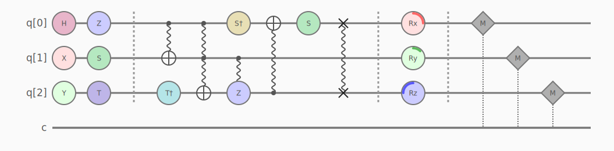
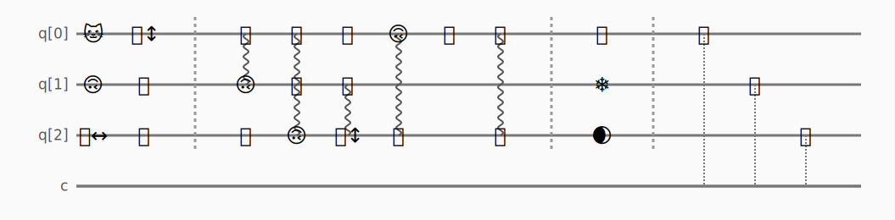

# Quantum QuirkVis 🙃

A python package that draws quantum circuits written in qasm/OpenQASM 3.0 and outputs as SVG with a strong focus on personalization.

## Features
- SVG output
- Theming engine (JSON)
- Personalization (night mode, custom colors)
- Gate symbol substitutions (emojis, icons, animations)
- Awesome "dial" for parametrized gates
- Animations and other CSS filters
- Lightweight

# Themes
### Default

### Night

### Matrix

### Emoji


## Installation
```bash
pip install .
```

## Usage
```python
from quantum_quirkvis import draw

qasm_str = """
OPENQASM 3.0;
qubit[2] q;
h q[0];
cx q[0], q[1];
"""

draw(qasm_str, theme="matrix", filename="path/to/file.svg")

# or

svg = draw(qasm_str, theme="matrix")
```

## Personalization
Check the themes json files to see how much you can customize, you can customize anything!

Then create your own theme, you don't need to overwrite all the file, you only have to change the values of interest, the rest if defaulted.

- mytheme.json
```json
{
    "name": "default",
    "styles": {
        "background": "#777777",
    }
}
```

then simply

```python
draw(qasm_str, theme="mytheme.json")
```

## Libraries
The current package just requires openqasm to parse the qasm files or string into the AST that is processed to create SVG with the selected theme.

## License
MIT

## Limitations
Currently the library "unrolls" the circuit, therefore complex or custom gates (like CY, Toffoli, CSWAP, etc) are drawn as their primitives.

U-n gates are not yet supported

## unitaryDESIGN
This repo is currently running for a bounty on [unitaryDESIGN](unitary.design) hackathon

